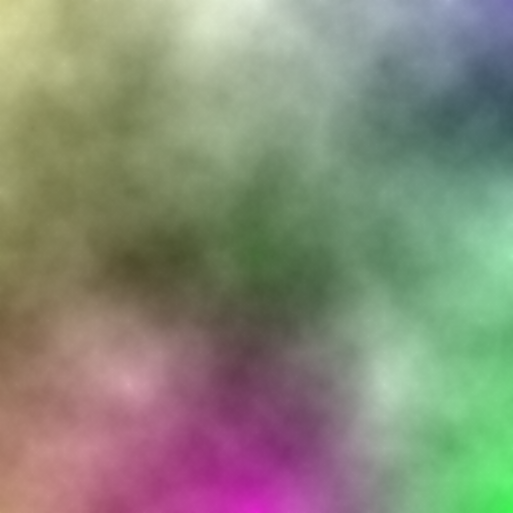
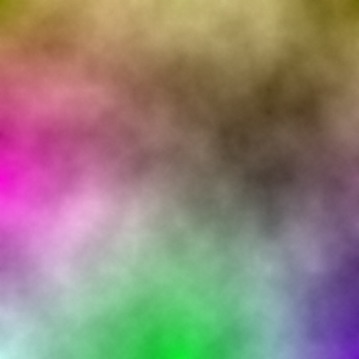

# RMG_Random-Map-Generator
"RMG : Random Map Generator" is a python project that allows you to generate random map in a PNG format !

-------------------------------------------------------------------------------------------------------------------------------------------------------------------------

How does RMG work ?

- genererBase.py is a python implementation of the "Diamond-Square" algorithm. After using it, it's gonna generate a random black and white or colored image.
- traiterBase.py generates different types of maps from a black and white random image. The brighter a pixel, the deeper the corresponding point on the map. The darker a pixel, the higher the corresponding point on the map.
- genererCase.py is a python script that takes the three attributes of a color as parameters. The program will then generate a 16 by 16 image made up of colors close to the one passed as a parameter.

Later, the generated maps will be used to make characters move there. Each map pixel will be replaced by a square generated from that pixel's color. This generation of random squares will allow a diversification of the textures of the ground.

-------------------------------------------------------------------------------------------------------------------------------------------------------------------------

Some black and white results of the "Diamond-Square" algorithm :

   

Some colored results of the "Diamond-Square" algorithm :

   

Here are the examples of every possible country types. They were generated from the first black and white "Diamond-Square" algorithm result exemple.

   

Here is a color ( 255, 150, 150 ). Next to her are examples of squares generated from her color.

       
       
