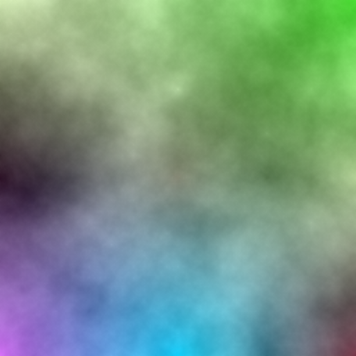
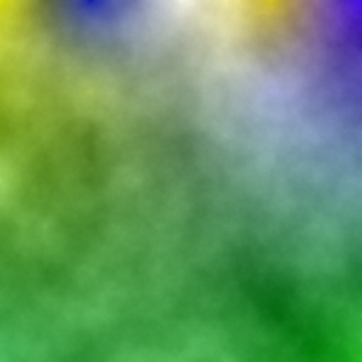
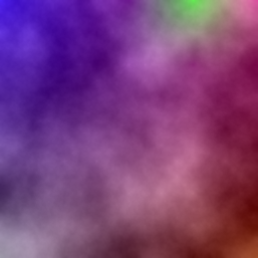

# RMG_Random-Map-Generator
"RMG : Random Map Generator" is a python project that allows you to generate random map in a PNG format !

-------------------------------------------------------------------------------------------------------------------------------------------------------------------------

How does RMG work ?

- genererImage.py is a python implementation of the "Diamond-Square" algorithm. After using it, it's gonna generate a random black and white or colored image.
- traiterImage.py generates different types of maps from a black and white random image. The brighter a pixel, the deeper the corresponding point on the map. The darker a pixel, the higher the corresponding point on the map.

-------------------------------------------------------------------------------------------------------------------------------------------------------------------------

Some black and white results of the "Diamond-Square" algorithm :

   

Some colored results of the "Diamond-Square" algorithm :

   

Here are the examples of every possible country types. They were generated from the first black and white "Diamond-Square" algorithm result exemple.

   
